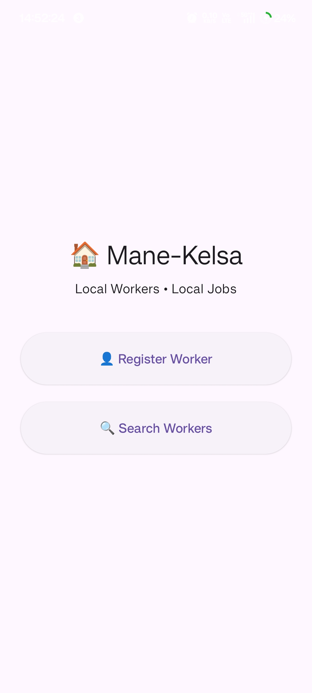
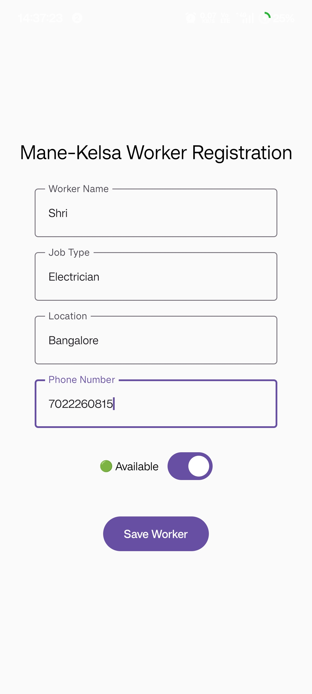
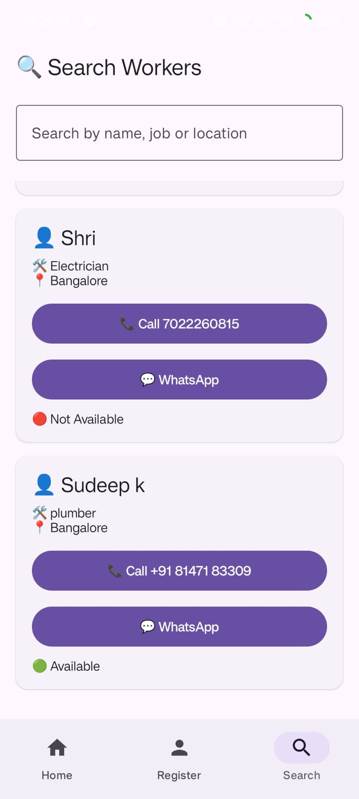
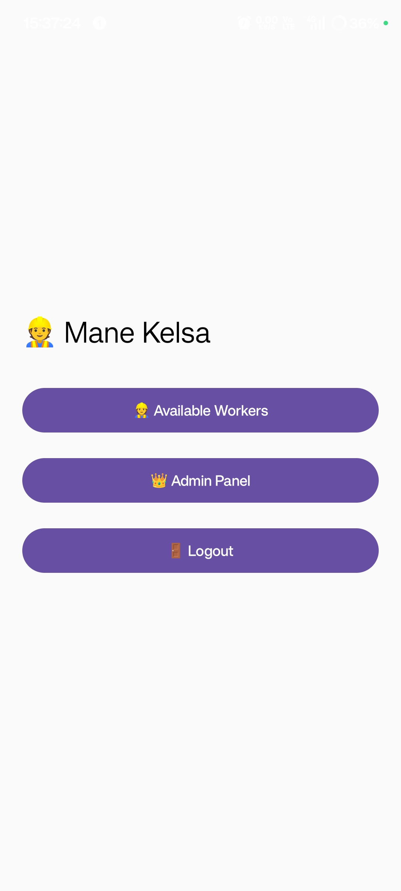
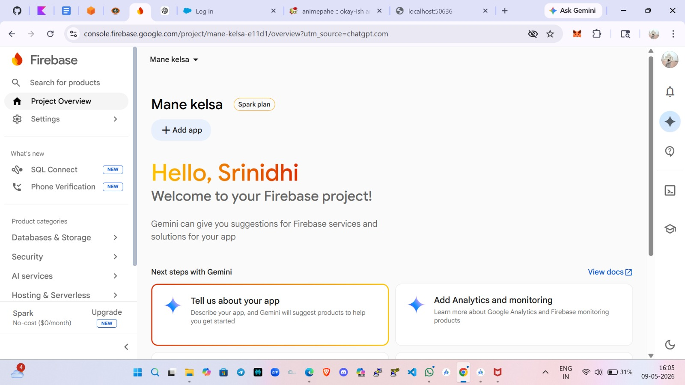
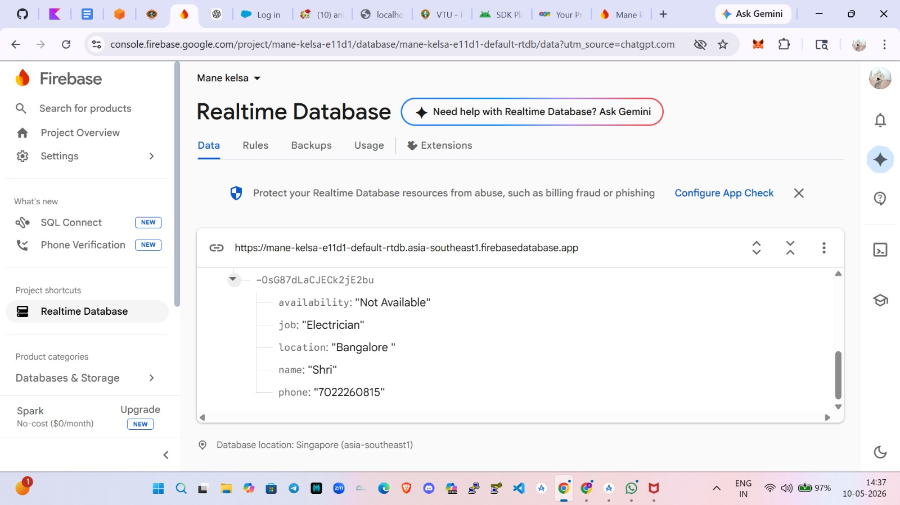
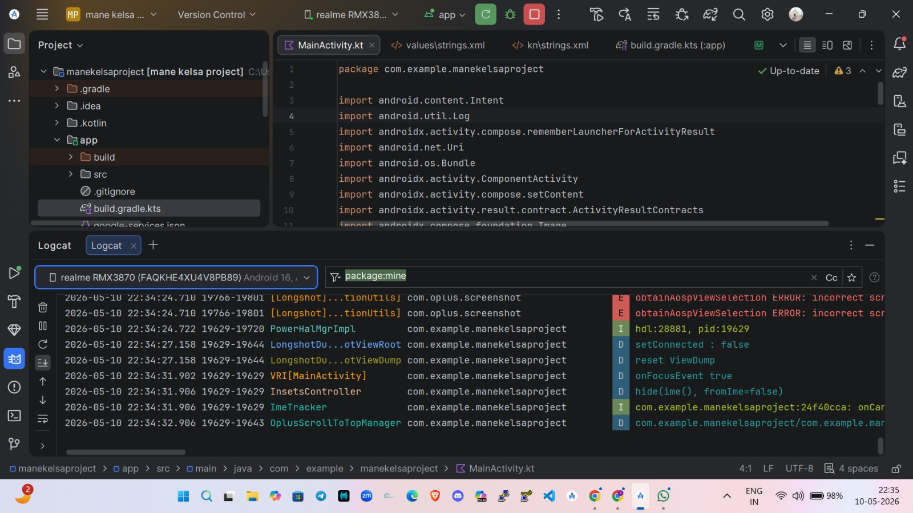

# Mane Kelsa GenAI App

A native Android application built with Kotlin for connecting local workers with local jobs.

## Features

* Register workers with name, job type, location, phone number, and availability.
* Search available workers by name, job, or location.
* Contact workers through phone calls or WhatsApp.
* Store worker details using Firebase Realtime Database.

## Screenshots

| Home | Worker Registration |
| --- | --- |
|  |  |

| Search Workers | Search Results |
| --- | --- |
|  |  |

| Admin Panel | Firebase Overview |
| --- | --- |
|  |  |

| Firebase Realtime Database | Android Studio Logcat |
| --- | --- |
|  |  |

## Tech Stack

* **Language:** [Kotlin](https://kotlinlang.org/)
* **IDE:** [Android Studio](https://developer.android.com/studio)
* **Build System:** Gradle Kotlin DSL
* **Backend:** Firebase Realtime Database

## Getting Started

Clone the repository:

```bash
git clone https://github.com/shrinidhi574-hub/ManeKelsa-GenAI-App.git
```

Open the project in Android Studio and run it on an emulator or Android device.
